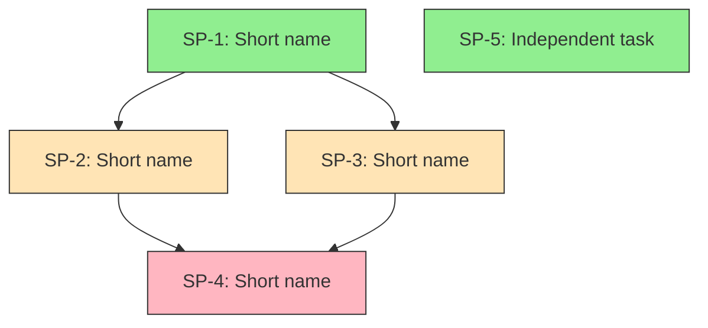

# Problem Decomposition & DAG Construction Guide

Reference this guide when decomposing problems into sub-problems and building dependency graphs.

## Principles of Good Decomposition

### 1. Atomic Sub-Problems

Each sub-problem should be:

- **Independently understandable** — A reader can understand what needs to be done from the sub-problem file alone (plus linked business/technical docs)
- **Independently solvable** — Once dependencies are met, no other sub-problem needs to be solved simultaneously
- **Single responsibility** — Each sub-problem addresses one concern, not a mix of concerns
- **Testable** — Has clear acceptance criteria that can be verified in isolation

### 2. Right Size

A sub-problem is too big if:
- It contains multiple unrelated concerns
- Its acceptance criteria span different domains (UI + backend + data migration)
- A developer would naturally break it into smaller tasks before starting

A sub-problem is too small if:
- It cannot be meaningfully verified on its own
- It creates excessive dependency chains for trivial work
- Combining it with a related sub-problem wouldn't add complexity

### 3. Minimize Dependencies

Prefer decompositions that create more independent sub-problems over those that create long dependency chains. Wide, shallow DAGs are better than deep, narrow ones — they allow more parallel work.

## Identifying Sub-Problems

### Step 1: List All Concerns

Start by listing everything that needs to happen, without worrying about structure:

- Data model changes
- API/interface changes
- Business logic implementation
- UI/UX changes
- Migration/data transformation
- Integration with external systems
- Configuration changes
- Testing requirements

### Step 2: Group by Independence

Cluster concerns that **must** change together (they're one sub-problem) and separate concerns that **can** change independently (they're separate sub-problems).

**Must change together:**
- A database column and the code that reads/writes it
- An API endpoint and its request/response validation

**Can change independently:**
- A backend API and the frontend that consumes it (interface contract is the boundary)
- Two independent business rules that don't interact

### Step 3: Identify Interfaces Between Sub-Problems

Where sub-problems depend on each other, define the interface:
- What does the upstream sub-problem produce?
- What does the downstream sub-problem consume?
- Can you define a contract (API shape, data format, behavior spec) between them?

Clear interfaces between sub-problems make them easier for separate agents to implement.

## Dependency Analysis

### Types of Dependencies

| Type | Description | Example |
|---|---|---|
| **Data dependency** | Sub-problem B needs data/schema created by A | API endpoint needs the database table to exist |
| **Interface dependency** | Sub-problem B consumes an API/contract defined by A | Frontend component needs backend API contract |
| **Logic dependency** | Sub-problem B's business logic builds on A's | Discount calculation needs price calculation |
| **Sequential dependency** | B must happen after A for operational reasons | Data migration must happen before new code deploys |
| **Knowledge dependency** | Solving A reveals information needed to design B | Investigation task reveals the root cause, which determines the fix |

### Identifying Dependencies

For each pair of sub-problems, ask:
1. "Can sub-problem B be solved if A doesn't exist yet?" — If no, B depends on A.
2. "Does B need to know the output or design of A?" — If yes, B depends on A.
3. "Would changing A's solution require changing B?" — If yes, there's likely a dependency.
4. "Can A and B be worked on simultaneously by different people?" — If no, find the dependency.

### Avoiding False Dependencies

Not every relationship is a dependency:
- **Shared context** is not a dependency — Two sub-problems using the same database doesn't make one depend on the other
- **Preferred ordering** is not a dependency — "It would be nice to do A first" is different from "B cannot be done without A"
- **Implementation convenience** is not a dependency — "It's easier to test B after A" doesn't mean B depends on A

Only mark a dependency when B **cannot be correctly implemented or verified** without A being complete.

## Building the DAG

### Step 1: Create the Node List

Each sub-problem becomes a node with:
- Unique ID (SP-1, SP-2, etc.)
- Name (short, descriptive)
- Brief description
- Risk level (Low / Medium / High)

### Step 2: Add Edges

For each dependency identified, add a directed edge from the dependency to the dependent:
- SP-1 → SP-2 means "SP-2 depends on SP-1" (SP-1 must be done first)

### Step 3: Validate the DAG

Check for:
- **Cycles** — If you find A → B → C → A, there's a cycle. This means the decomposition is wrong. Merge the cyclic sub-problems or re-decompose.
- **Unnecessary edges** — If A → B → C and A → C, the A → C edge may be redundant (transitive dependency). Keep it only if C directly depends on A's output beyond what B provides.
- **Disconnected nodes** — Independent sub-problems with no edges are fine — they can start immediately.
- **Critical path** — Identify the longest dependency chain. This determines the minimum sequential work.

### Step 4: Determine Execution Layers

Group sub-problems into layers for execution:

- **Layer 1:** All sub-problems with no dependencies (can start immediately, can run in parallel)
- **Layer 2:** All sub-problems whose dependencies are all in Layer 1 (can start once Layer 1 is complete)
- **Layer N:** All sub-problems whose dependencies are all in Layers 1 through N-1

### Mermaid Syntax Reference



Color coding:
- Green (`#90EE90`): Independent sub-problems (no dependencies) — start here
- Orange (`#FFE4B5`): Dependent sub-problems (standard risk)
- Red (`#FFB6C1`): Critical or high-risk sub-problems

### YAML Schema Reference

```yaml
sub_problems:
  - id: "SP-1"
    name: "Short descriptive name"
    description: "What this sub-problem involves"
    dependencies: []          # List of SP IDs this depends on
    risk: "low"               # low | medium | high
    detail_file: "sub-problems/sp-1-name.md"

execution_order:
  - layer_1: ["SP-1", "SP-5"]    # Independent — start here
  - layer_2: ["SP-2", "SP-3"]    # Depends on layer 1
  - layer_3: ["SP-4"]            # Depends on layer 2

critical_path: ["SP-1", "SP-3", "SP-4"]  # Longest dependency chain
estimated_parallelism: 2          # Max sub-problems that can run in parallel
```

## Common Decomposition Patterns

### Pattern 1: Data → Logic → Interface

Many features follow this pattern:
1. **Data layer** (schema, migrations, models) — independent
2. **Business logic** (rules, calculations, validation) — depends on data layer
3. **Interface** (API, UI, integration) — depends on business logic

### Pattern 2: Investigation → Fix → Verify

Bugs often follow this pattern:
1. **Investigate** (reproduce, trace root cause) — independent
2. **Fix** (implement the change) — depends on investigation
3. **Verify** (regression test, edge case validation) — depends on fix

### Pattern 3: Independent Verticals

Some features are naturally independent verticals that can be developed in parallel:
1. **Vertical A** (its own data + logic + interface) — independent
2. **Vertical B** (its own data + logic + interface) — independent
3. **Integration** (connect the verticals) — depends on A and B

### Pattern 4: Shared Foundation

Multiple sub-problems share a common foundation:
1. **Foundation** (shared data model, common utilities) — independent
2. **Feature A** — depends on foundation
3. **Feature B** — depends on foundation
4. **Feature C** — depends on foundation

## Anti-Patterns to Avoid

| Anti-Pattern | Problem | Fix |
|---|---|---|
| **God sub-problem** | One sub-problem that everything depends on and does too much | Break it into smaller pieces; find the minimal foundation others actually need |
| **Linear chain** | SP-1 → SP-2 → SP-3 → SP-4 with no parallelism | Re-examine if all dependencies are real; often some sub-problems can be made independent |
| **Micro-decomposition** | 20+ tiny sub-problems for a simple feature | Merge related sub-problems; aim for the minimum number of independently meaningful units |
| **Missing integration sub-problem** | Independent pieces that need to work together, but no sub-problem for the integration work | Add an explicit integration/glue sub-problem that depends on the pieces |
| **Circular reasoning** | "A needs B to determine requirements, B needs A to determine requirements" | One of them must be solved with assumptions first; make the assumption explicit and add a validation step |
