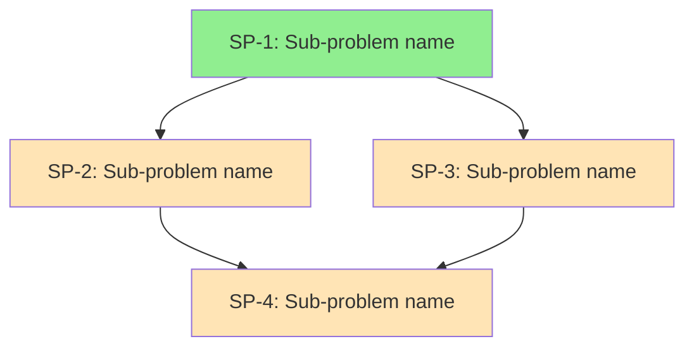

# Document Templates

Reference this file for the complete templates of each document type generated by the AI Documenter Agent skill.

## Root Index: `docs/readme.md`

```markdown
# Project Documentation

Central index for all project documentation. This documentation is structured for consumption by both humans and AI agents.

## Folder Structure

| Folder | Purpose | When to Read |
|---|---|---|
| [business/](business/readme.md) | Business context, domain rules, glossary | When you need to understand the business domain, terminology, or rules |
| [technical/](technical/readme.md) | Architecture, constraints, tech stack | When you need to understand technical systems, integrations, or constraints |
| [features/](features/) | Feature documentation with sub-problem breakdowns | When implementing a new feature |
| [bugs/](bugs/) | Bug documentation with root cause analysis | When investigating or fixing a bug |

## Recently Updated

| Document | Last Updated | Summary |
|---|---|---|
| _List documents here with dates and one-line summaries_ | | |
```

## Business Index: `docs/business/readme.md`

```markdown
# Business Context

Index of all business context documentation. Read this file first to understand what business knowledge has been captured.

## Core Documents

| Document | Description |
|---|---|
| [glossary.md](glossary.md) | Domain terminology and definitions |
| _Add topic-specific docs as rows here_ | |

## Coverage Summary

Brief description of what business domains have been documented and what gaps remain.
```

## Glossary: `docs/business/glossary.md`

```markdown
# Domain Glossary

Terminology and definitions specific to this business domain. Reference this when encountering unfamiliar terms in other documentation or in the codebase.

## Terms

### [Term]
**Definition:** Clear, unambiguous definition.
**Context:** When and where this term is used.
**Related terms:** Links to related glossary entries.
**Source:** Who provided this definition or where it was confirmed.

---

_Repeat for each term. Keep alphabetically sorted._
```

## Technical Index: `docs/technical/readme.md`

```markdown
# Technical Context

Index of all technical documentation. Read this file first to understand what technical knowledge has been captured.

## Core Documents

| Document | Description |
|---|---|
| [constraints.md](constraints.md) | Non-functional requirements (performance, security, scale) |
| _Add topic-specific docs as rows here_ | |

## Coverage Summary

Brief description of what technical areas have been documented and what gaps remain.
```

## Constraints: `docs/technical/constraints.md`

```markdown
# Non-Functional Requirements & Constraints

Technical constraints that affect solution design across all features and bug fixes.

## Performance

| Metric | Requirement | Context |
|---|---|---|
| _e.g., API response time_ | _< 200ms p95_ | _Per SLA with enterprise clients_ |

## Security

| Requirement | Details | Compliance Driver |
|---|---|---|
| _e.g., Data encryption_ | _At rest and in transit_ | _SOC 2 / GDPR_ |

## Scale

| Dimension | Current | Expected Growth | Notes |
|---|---|---|---|
| _e.g., Daily active users_ | _10,000_ | _100,000 in 12 months_ | _Affects caching strategy_ |

## Infrastructure Constraints

- _List constraints imposed by infrastructure choices_

## Known / Open Questions

- [ ] _Any constraints that need confirmation_
```

## Feature Overview: `docs/features/{feature-name}/overview.md`

```markdown
# Feature: {Feature Name}

## Problem Statement

_Clear description of the problem this feature solves, in business terms._

## Goal

_What should be true when this feature is complete?_

## Stakeholders

| Stakeholder | Role | Key Concerns |
|---|---|---|
| _Name/team_ | _Their relationship to this feature_ | _What they care about most_ |

## Business Context

_Summary of relevant business rules and context. Link to docs/business/ documents rather than duplicating._

**Relevant business docs:**
- [Link to relevant business doc](../../business/{doc}.md)

## Technical Context

_Summary of relevant technical systems and constraints. Link to docs/technical/ documents rather than duplicating._

**Relevant technical docs:**
- [Link to relevant technical doc](../../technical/{doc}.md)

## Acceptance Criteria (Feature-Level)

- [ ] _Concrete, testable condition 1_
- [ ] _Concrete, testable condition 2_
- [ ] _..._

## Known

| Item | Detail | Source / Confidence |
|---|---|---|
| _What is known_ | _Specifics_ | _Who confirmed this / how confident_ |

## Unknown / Open Questions

| Question | Why It Matters | Who Might Know | Impact of Guessing Wrong | Default Assumption |
|---|---|---|---|---|
| _Open question_ | _How it affects the solution_ | _Person/team_ | _Risk level_ | _Safest assumption if unanswered_ |

## Examples & Edge Cases

### Example 1: {Scenario Name}
**Given:** _Initial conditions_
**When:** _Action or event_
**Then:** _Expected outcome_

### Edge Case 1: {Scenario Name}
**Scenario:** _Description of the unusual case_
**Expected behavior:** _What should happen_
**Why it matters:** _Impact if handled incorrectly_

## Risk Assessment

| Risk | Likelihood | Impact | Mitigation |
|---|---|---|---|
| _What could go wrong_ | _Low/Medium/High_ | _What breaks_ | _How to reduce the risk_ |

## Sub-Problems

See [decomposition.md](decomposition.md) for the breakdown into sub-problems and dependency graph.
```

## Feature Decomposition: `docs/features/{feature-name}/decomposition.md`

```markdown
# Decomposition: {Feature Name}

## Sub-Problem Summary

| ID | Sub-Problem | Dependencies | Risk | Status |
|---|---|---|---|---|
| SP-1 | _Name_ | None (independent) | Low | Not started |
| SP-2 | _Name_ | SP-1 | Medium | Not started |
| SP-3 | _Name_ | SP-1 | High | Not started |
| SP-4 | _Name_ | SP-2, SP-3 | Low | Not started |

## Dependency Graph (Mermaid)



## Dependency Graph (YAML)

```yaml
sub_problems:
  - id: SP-1
    name: "Sub-problem name"
    description: "Brief description"
    dependencies: []
    risk: low
    detail_file: sub-problems/sp-1-name.md
  - id: SP-2
    name: "Sub-problem name"
    description: "Brief description"
    dependencies: [SP-1]
    risk: medium
    detail_file: sub-problems/sp-2-name.md
  - id: SP-3
    name: "Sub-problem name"
    description: "Brief description"
    dependencies: [SP-1]
    risk: high
    detail_file: sub-problems/sp-3-name.md
  - id: SP-4
    name: "Sub-problem name"
    description: "Brief description"
    dependencies: [SP-2, SP-3]
    risk: low
    detail_file: sub-problems/sp-4-name.md

execution_order:
  - layer_1: [SP-1]        # Independent — start here
  - layer_2: [SP-2, SP-3]  # Can be done in parallel after SP-1
  - layer_3: [SP-4]        # Requires SP-2 and SP-3
```

## Recommended Execution Order

1. **Start with:** SP-1 (independent, no blockers)
2. **Then (parallel):** SP-2, SP-3 (both depend only on SP-1)
3. **Finally:** SP-4 (depends on SP-2 and SP-3)

_Rationale for ordering and any notes about which sub-problems are most critical._
```

## Sub-Problem Detail: `docs/features/{feature-name}/sub-problems/{sub-problem}.md`

```markdown
# Sub-Problem: {SP-ID} — {Sub-Problem Name}

## Description

_Clear description of what this sub-problem involves and why it's a separate unit of work._

## Dependencies

| Depends On | What It Needs From That Sub-Problem |
|---|---|
| _SP-X_ | _Specific output or capability required_ |

## Depended On By

| Needed By | What This Sub-Problem Provides |
|---|---|
| _SP-Y_ | _Specific output or capability this provides_ |

## Business Context

_Business rules and context relevant to this specific sub-problem. Link to docs/business/ where possible._

## Technical Context

_Technical details relevant to this specific sub-problem. Link to docs/technical/ where possible._

## Acceptance Criteria

- [ ] _Concrete, testable condition 1_
- [ ] _Concrete, testable condition 2_
- [ ] _Concrete, testable condition 3_

## Examples

### Example 1: {Scenario Name}
**Given:** _Initial conditions_
**When:** _Action or event_
**Then:** _Expected outcome_

## Edge Cases

| Scenario | Expected Behavior | Notes |
|---|---|---|
| _Description_ | _What should happen_ | _Why this matters_ |

## Known

| Item | Detail |
|---|---|
| _Fact_ | _Specifics_ |

## Unknown / Open Questions

| Question | Impact of Guessing Wrong | Default Assumption |
|---|---|---|
| _Question_ | _Risk_ | _Safest guess_ |

## Risk Assessment

**Risk level:** Low / Medium / High
**Impact if solved incorrectly:** _Description of what would break_
**Mitigation:** _How to reduce risk_
```

## Bug Overview: `docs/bugs/{bug-name}/overview.md`

Use the same structure as the Feature Overview template above, with these adjustments:

- Replace "Problem Statement" with **Bug Description** (observed behavior vs. expected behavior)
- Replace "Goal" with **Expected Fix Outcome**
- Add a **Reproduction Steps** section
- Add a **Root Cause Hypothesis** section (if known)
- The decomposition focuses on investigation steps and fix components rather than feature components

## Bug Decomposition: `docs/bugs/{bug-name}/decomposition.md`

Use the same structure as the Feature Decomposition template, with sub-problems reframed as:

- Investigation tasks (confirm root cause, identify affected areas)
- Fix components (individual changes needed)
- Verification tasks (regression testing, edge case validation)

## Notes on Template Usage

- **Do not include empty sections** — If a section has no content, omit it rather than leaving it blank
- **Prefer links over duplication** — Always link to existing docs in `docs/business/` and `docs/technical/` rather than copying content into feature/bug docs
- **Keep sub-problem files focused** — Each sub-problem file should be self-contained enough that an AI agent can work on it by reading only that file plus any linked business/technical docs
- **Update indexes** — Every time a new document is created, update the relevant `readme.md` index file
